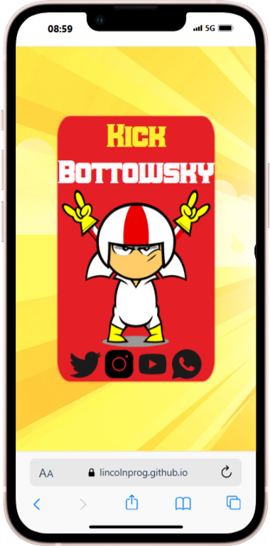
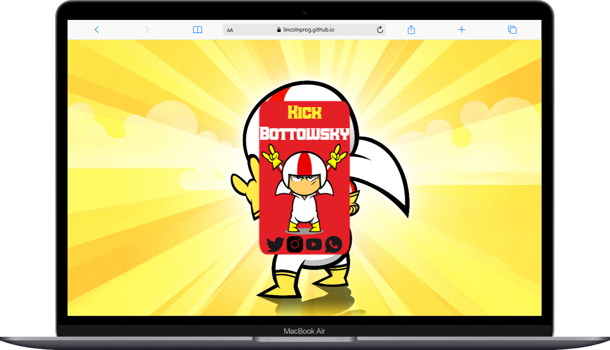

# Aprendendo git com o Kick Bodosky 

O intutito deste repositorio é aprender as melhores prataicas de versionamento de projeto atraves de tecnologia git agregado a plataforma de codigos github.

## Site proposto: Perfil Kick Bodosky 

- [x]  Estrutura base Html
- [x] Organizando arquiterura de projetos front 
 - assets
- img
- fonts
    
- [x] Realizando primeiro commit
- [x] Estilo Inicial CSS
- [x] Realizando segundo commit
- [x] Enviando ao github 

## Instruções GIT

| Instrução | Descrição | 
|-|-| 
|git init| Iniciar o monitoramento do projeto| 
|git status| verifica o estado dos arquivos presentes|
|git add| Prepara os arquivos para uma nova versão | 
|git commit -m "mensagem"| Cria uma nova versão.giy 
|git remote| verifica ou adiciona uma origem remota|
|git log| verifica os comits presentes| 
|git clone| clona um repositorio remoto|
|git push| avisa para o repositorio remoto a produçao local|

### Instruções de confuguração GIT

|instrução| Descrição | 
|-|-| 
|git config list| lista de configurações| 
|git config --global user.name | configura o nome de usuario | 
|git config --global user.email | configura email do usuario |

# Blog Kick Bottowsky

    
    

Site Desenvolvido em tecnologia HTML e CSS com responsividade presente em tablets e smartphone.

[Acesse aqui](https://lincolnprog.github.io/Aula_Git/)

